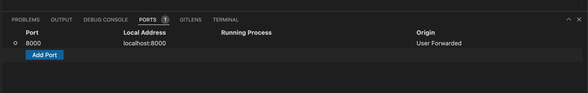

# ZincSearch documentation

Documentation is built using [Material for MkDocs](https://squidfunk.github.io/mkdocs-material/).

Best way to start with updating documentation is to open this repo using [vs code dev containers](https://code.visualstudio.com/docs/remote/containers)

You will need to fix/delete/comment mounts section in `.devcontainer/devcontainer.json` before you open the repo in dev container.

Once you have opened the source code in dev container, run the following command to start documentation server:

```sh
mkdocs serve
```

Expose port 8000



Now you will be able to open the docs on http://localhost:8000

To generate docs without vscode run below command

```sh
docker run --rm -it -v $PWD:/site squidfunk/mkdocs-material build
```

