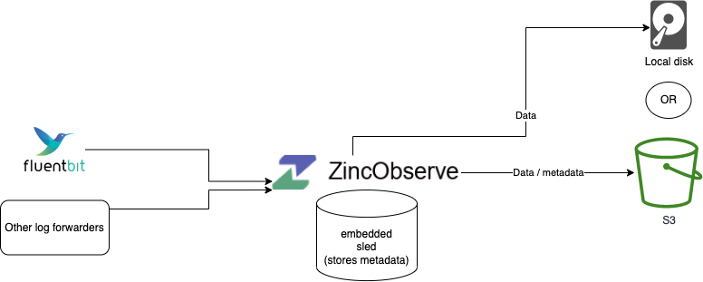

# Architecture

ZincObserve can be run in single node or in a cluster in HA mode.

## Single Node

### Using sled

Use this mode for light usage and testing. This is the default mode for running ZincObserve.

