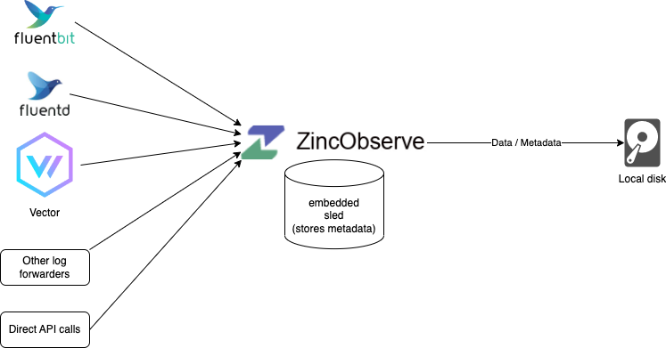
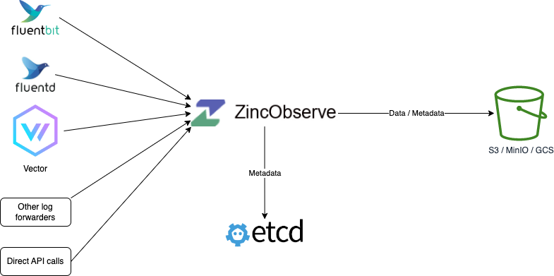
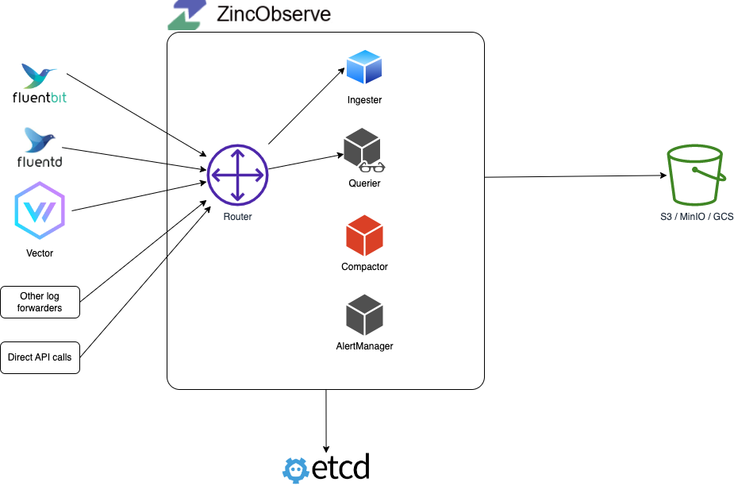

> Applicable to open source & enterprise version
# Architecture and deployment modes

ZincObserve can be run in single node or in HA mode in a cluster. 

## Single Node

Please refer to [quickstart](/ZincObserve/quickstart) for single node deployments.

### Sled and Local disk

Use this mode for light usage and testing or if HA is not a requirement for you. (You could still ingest and search over 2 TB on a single machine per day. On a mac M2 in our tests, you can ingest at ~31 MB/Second or 1.8 GB/Min or 2.6 TB/Day with default configuration). This is the default mode for running ZincObserve. Check [Quickstart](/ZincObserve/quickstart) to find various ways to get this setup done.

### Sled and Object storage

### etcd and object storage

## High Availability (HA) mode

Local disk storage is not supported in HA mode. Please refer to [HA Deployment](/ZincObserve/ha_deployment) for cluster mode deployment.

### etcd and object storage

Router, Querier and ingester nodes can be horizontally scaled to accomodate for higher traffic.

## Components

### Ingester

### Querier

### Compactor

### Router

### AlertManager

