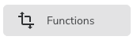
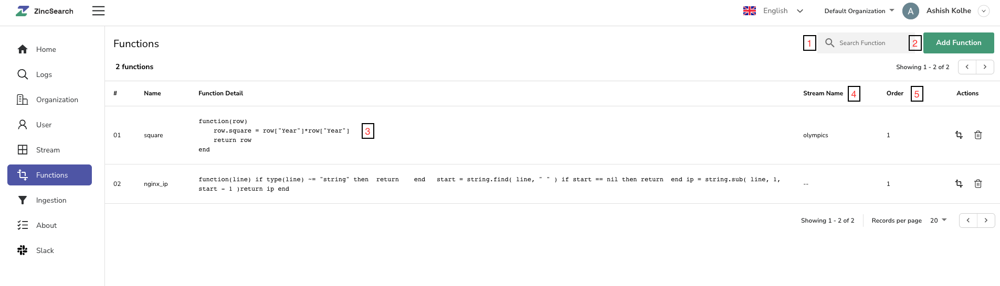

# Functions

## What are functions?

Functions in zinc observe are defined using [lua script](https://www.lua.org/) & can used during ingestion & query to aid advanced capabilities like enrichment, redaction, log reduction, compliance, etc. 

Based on function applicability , functions can be categorized as :

1. Ingest time function
1. Query function

** Ingest time function ** : This type of function is applicable during ingestion for a specific stream.

** Query function ** : This type of function is applicable to queries , doesn't need stream to be specified while defining function. This kind of function can be used for all the streams belonging one's organization.

To navigate to functions in zinc observe , select preferred organization using organization selection control, then click on  menu , which will take one to  functions list screen. The screen lists all (ingest time & query type) the functions for selected organization.  

List screen details :

1. Search in listed function
1. Add new function
1. Lua script for existing function
1. Name of stream if function is ingest time function
1. In case of ingest time function,order in which functions are applied starting with lowest order number to higher order number

